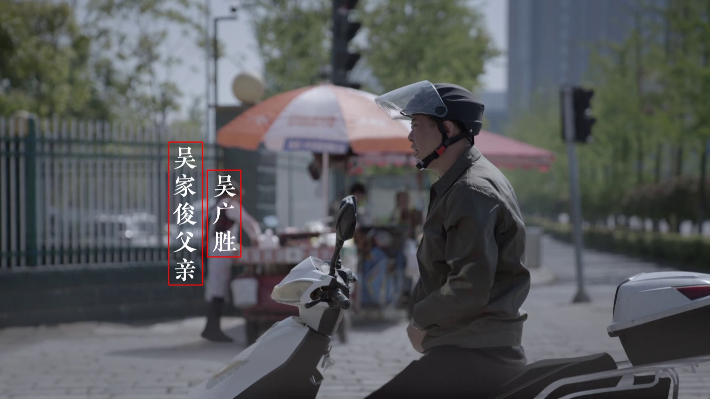

## C++ implementation of CRAFT text detector with TensorRT 
CRAFT: Character-Region Awareness For Text detection | [Paper ](https://arxiv.org/abs/1904.01941) | [Official Pytorch code](https://github.com/clovaai/CRAFT-pytorch)

### Overview

This is a C++ implementation for the CRAFT text detector with TensorRT for accelerated inference. Compared to the official PyTorch implementation, it significantly improves text detection efficiency and facilitates deployment.

Upon testing, the inference speed on RTX 4090 is **x12 faster** than the original CRAFT-pytorch project.

In addition, I have also provided a Chinese and English video subtitle detection model fine-tuned using a custom dataset, which offers higher accuracy in subtitle detection.

<p float="left">
  
   
</p>

### Getting started

#### Requirements
- gcc
- CUDA
- TensorRT

The environment we tested with is GCC 7.3.1 + CUDA 11.2 + TensorRT-8.5.3.1


#### Generate trt engine

1. Download the .pth model and place it in the 'pretrained' directory.

    - Official pretrained model: [craft_mlt_25k.pth](https://drive.google.com/open?id=1Jk4eGD7crsqCCg9C9VjCLkMN3ze8kutZ)

    - I used a custom dataset to fine-tune the Chinese and English subtitle detection model：[epoch_91.pth](https://drive.google.com/file/d/1Run2AFipEKG53rNgvY4e4VTq88CQVvkq/view?usp=sharing)


2. Pth to Onnx

    ```shell
    cd engine_generation
    python torch2onnx.py --usefp16 --torch_path ../pretrained/craft_mlt_25k.pth
    ```

3. Onnx to trt engine
    ```shell
    export LD_LIBRARY_PATH=$LD_LIBRARY_PATH:/usr/local/trt/lib
    make
    ./onnx2trt ../pretrained/craft_mlt_25k_fp16.onnx ../pretrained/craft_mlt_25k_fp16_dynamic_shape.cache
    ```

#### Make and run demo
1. make
    ```shell
    cd src
    make
    cd ..
    make
    ```
2. run demo

    (1) If the input file is in image format:
    ```shell
    ./test_img <engine_path> <input_path>
    ```
    example:
    ```shell
    ./test_img ./pretrained/craft_mlt_25k_fp16_dynamic_shape.cache ./images/subtitle2.png
    ```
    (2) If the input file is in YUV format:
    ```shell
    ./main <engine_path> <height> <width> <yuv_file_path>
    ```
    example:
    ```shell
    ./test_yuv ./pretrained/craft_mlt_25k_fp16_dynamic_shape.cache 2160 3840 ./images/test_3840x2160_nv12.yuv
    ```
    

#### Interface Specification

The following interface can be utilized to integrate into your own code.

- Initialization and loading of the TRT engine
    ```c++
    void infer_init(int height, int width, const char* engine_path, float ratio)
    ```


    * `height`: Height of the video/image

    * `width`: Width of the video/image

    * `engine_path`: Path to the engine

    * `ratio`: Scaling ratio for the input image, ranging from (0, 1], typically taken as 0.5

- Inference

    (1) If the input file is in image format:

    ```c++
    vector<int> infer_pipe_rgb(uint8_t *rgb)
    ```
    * `rgb`: The memory address of the RGB image stored in the form of planes.
    Returns a vector, sequentially storing x_min, x_max, y_min, y_max for each box.

    (2) If the input file is in YUV format:
    ```c++
    vector<int> infer_pipe(uint8_t **in_yuv, int format, int* line_size);
    ```    

    * `in_yuv`: Memory address of NV12 Y and UV planes

    Returns a vector, sequentially storing x_min, x_max, y_min, y_max for each box.
    
    

- Destruction
    ```
    void destroyObj()
    ```
    Call this function after all inferences are completed.